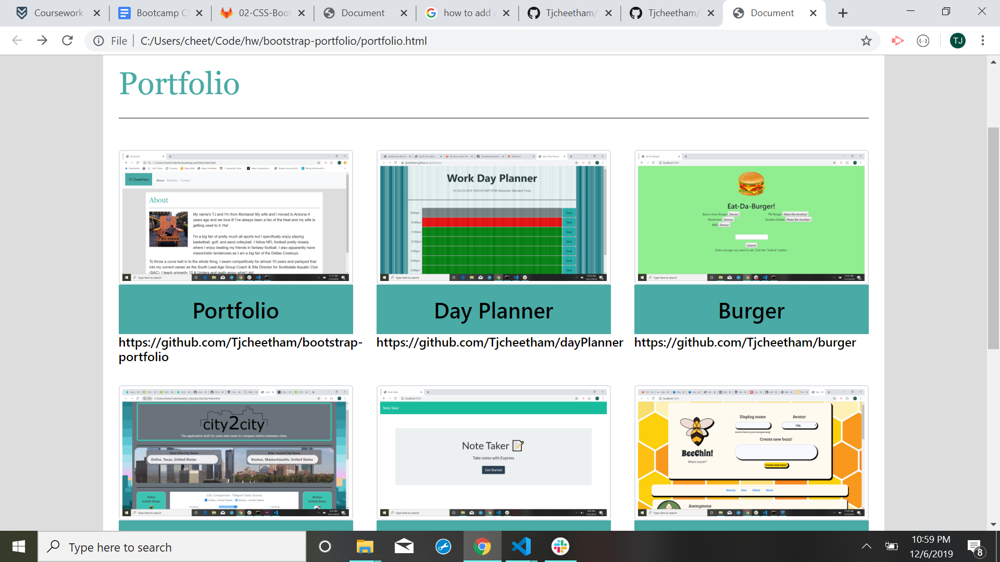

# Bootstrap Portfolio

### Description
My own portfolio website hosting a collection of my coding projects as well as resume, bio and links to GitHub and LinkedIn.

### Technologies-Libraries
[Bootstrap](https://getbootstrap.com/) - CSS - HTML

### Screenshots

### Link
Check it out!
https://tjcheetham.github.io/bootstrap-portfolio/.
